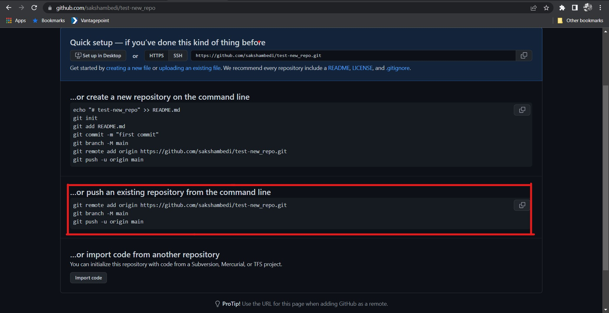
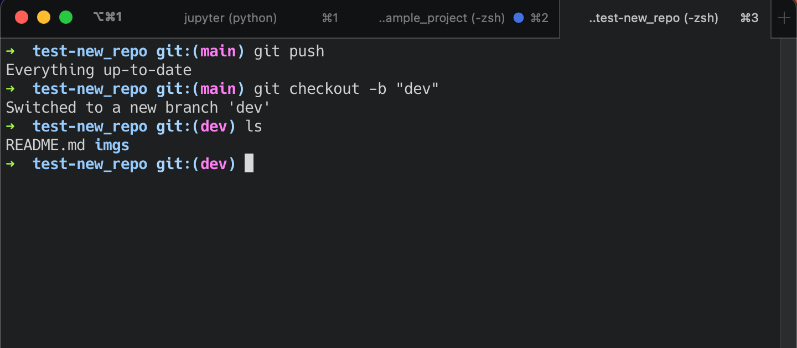
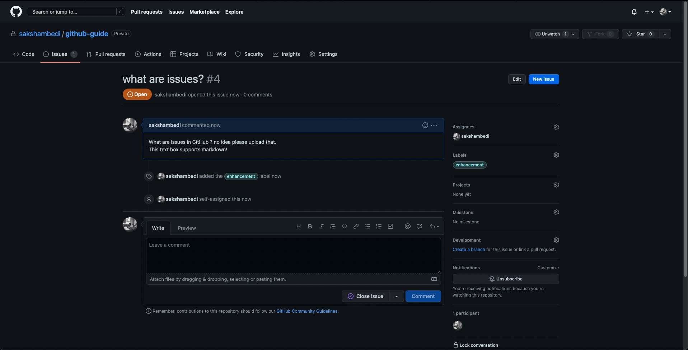
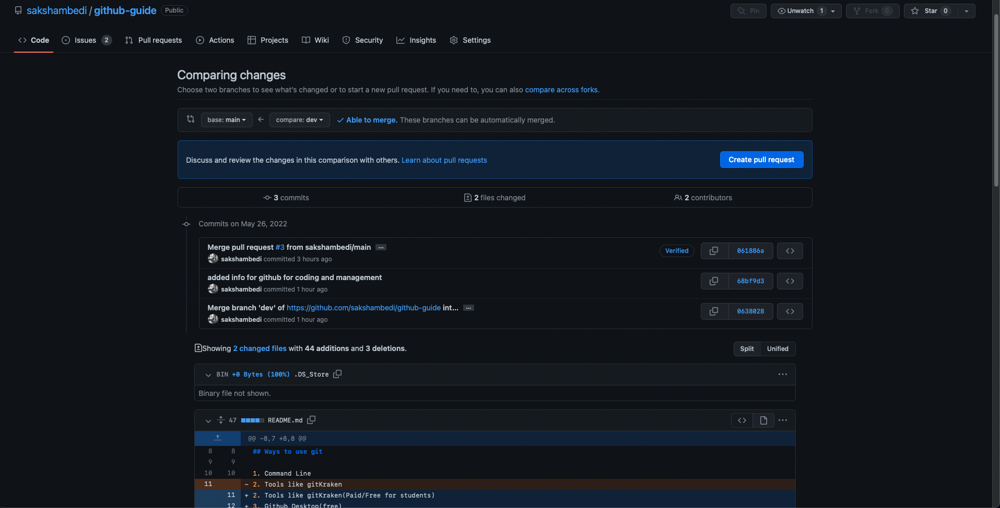

# GitHub and GIT Basic Guide

## Prerequisites

1. GIT
2. github account

## Ways to use git

1. Command Line
2. Tools like gitKraken(Paid/Free for students)
3. Github Desktop(free)

## Setting up with Git

1. Set Username

```bash
git config --<system_flag> user.name "<name>"
```

2. Set email

```bash
git config --<system_flag> user.email "<user_email>"
```

System flag can be set as:

- local : Repository-specific settings
- global : User-specific settings. This is where options set with the --global flag are restored.
- System : System-wide settings

### Example for setting config for the github

Create a shortcut for a Git command.
This is a powerful utility to create custom shortcuts for commonly used git commands.
A simplistic example would be

```bash
git config --global alias.ci commit
```

Now instead of "git commit", I can do "git ci" to start commit my changes.

## Copy a git repo

```bash
git clone <link_to_github_repo>
```

Example : We want to copy this demo repo

1. click on the Code.
2. Make sure you have selected the HTML option[1]
3. copy the link in the textbox
4. Run the following command in the terminal.


```bash
git clone https://github.com/sakshambedi/final_project_3380.git
```

You have successfully copied the repo to your local machine.

## Making a new Repo

1. Open the working directory in the terminal
2. Initiate a repo

```bash
git init
```

3. Make a git ignore file. A git ignore is a simple file used to disregard files that are not useful to share. You can download a git ignore template from github's [gitignore](https://github.com/github/gitignore) link, depending upon the type of project the user is working on. [More info on git ignore](https://www.atlassian.com/git/tutorials/saving-changes/gitignore).
4. Make a README.md file (optional)
5. Use "add" to add all the files you want to start keeping track of. -A flag = ALL which means it will add all the files except the ones mentioned in the .gitignore

```bash
git add -A
```

5. Commit your changes with the commit command. Use the -m = Message to add a message for the commit for reference.

```bash
git commit -m "<your message here>"
```

6. Now go to github and login into your account.
7. Click on ["NEW"](https://github.com/new) button on the top left. Give it a name, description (optional) and access (Private/Public). You do not need to a README.md file and a gitignore file. Choose a license if necessary and click "Create Repository"
8. Now you can push the local code to the existing repository on github. To do so follow the instructions in the "push an existing repository from the command line : "



## How branching works

Branching in github can be really useful to work in team without disturbing the production code.
[GUIDE TO BRANCHING](https://git-scm.com/book/en/v2/Git-Branching-Basic-Branching-and-Merging)

## Change working branch

```bash
git checkout <branch_name>
```

**NOTE :** Using the -b flag will create a new branch.

## Creating a new branch

```bash
git checkout -b <name_of_new_branch>
```



This how you create a new branch.
Once you have created a new branch you can do anything here and it will be stored locally. Once you are donw working on your implementation, you can push that new update to the cloud repository.

## Delete a branch

You can easily delete a branch using the -d flag

```bash
git branch -d <branch_name>
```

## Github for coder

Please follow the recommendation for git while working on the project.
A Git Project can have a main/master branch. This is the primary branch which can be used to publish a feature/update.

Recommendation by Jeremy.

- Main Branch : This is the primary branch and updates to this branch can only be pushed by people with Maintain and Admin roles. This branch can be set to CI/CD when a new update is pushed.
- DEV Branch : This is the branch where all of the active developement takes place. This can also be referred as a BETA branch. Once the code is reviewed and all the testing has passed, the code from this branch can be merged to main branch for release.

More branches can be created out of the dev branch to implement an individual feature and the baby branch can be merged back in the "DEV" branch.

_Recommened Reading:_ [Branching in a nutshell!](https://git-scm.com/book/en/v2/Git-Branching-Branches-in-a-Nutshell)

## Github for Management

Repository Roles for Organization

- Read : Recommended for non-code contributors who want to view or discuss your project
- Triage: Recommended for contributors who need to proactively manage issues and pull requests without write access
- Write: Recommended for contributors who actively push to your project
- Maintain: Recommended for project managers who need to manage the repository without access to sensitive or destructive actions
- Admin: Recommended for people who need full access to the project, including sensitive and destructive actions like managing security or deleting a repository

Organization owners can set base permissions that apply to all members of an organization when accessing any of the organization's repositories. For more information, see "Setting base permissions for an organization."

### Permissions for each role

Permission are available in Github to restrict and control the access of a repository.

[PERMISSIONS FOR EACH ROLES](https://docs.github.com/en/organizations/managing-access-to-your-organizations-repositories/repository-roles-for-an-organization#permissions-for-each-role)

_SOURCE :_ [LINK HERE](https://docs.github.com/en/organizations/managing-access-to-your-organizations-repositories/repository-roles-for-an-organization)

## Github as OAUTH

Github can also we used to authorize sign up and signing in for application.

_Resource :_ [Authorizing using Github](https://docs.github.com/en/developers/apps/building-oauth-apps/authorizing-oauth-apps)

## Issues in github

Issues in github is used to quickly create issues, track work and stay up to date with the bugs and issues in the project. It increases community envolvment and a medium of effective communication.

### Creating a issue

1. On the main page, go to the issues tab.
2. Click on new issue
3. Give it a title and a description. Choose a assignee, give it one label out of the followings :

   - bug
   - documentation
   - duplicate
   - invalid
   - question
   - wontfix

4. Choose the project if it is part of a project. Finally choose milestone.



Congratulations you have created your first issue!!
_NOTE :_ For an organization, the user must have admin or owner role to delete an issue.

### Pull request

This tab contains all of the pull request made by the teams. The changes can be reviewed on this page before making a final decision.



### Actions

Actions is an CI/CD platforms to assist automating building, testing and deploying pipeline. Users can run a workflow to automatically add the appropriate labels whenever someone creates a new issue in your repository.
Documentation for [Github Actions](https://docs.github.com/en/actions/learn-github-actions/understanding-github-actions)

## Projects

This part of github is still in beta.

## Wiki

Wiki is a section for hosting documentation. You can use your repository's wiki to share long-form content about your project, such as how to use it, how you designed it, or its core principles. A README file quickly tells what your project can do, while you can use a wiki to provide additional documentation

## What is a README.MD

A README is often the first item a visitor will see when visiting your repository. README files typically include information on:

- What the project does
- Why the project is useful
- How users can get started with the project
- Where users can get help with your project
- Who maintains and contributes to the project

## Settings

Setting contains all the settings for the repository, including ablity to change the name of the repo and ability to delete it.
